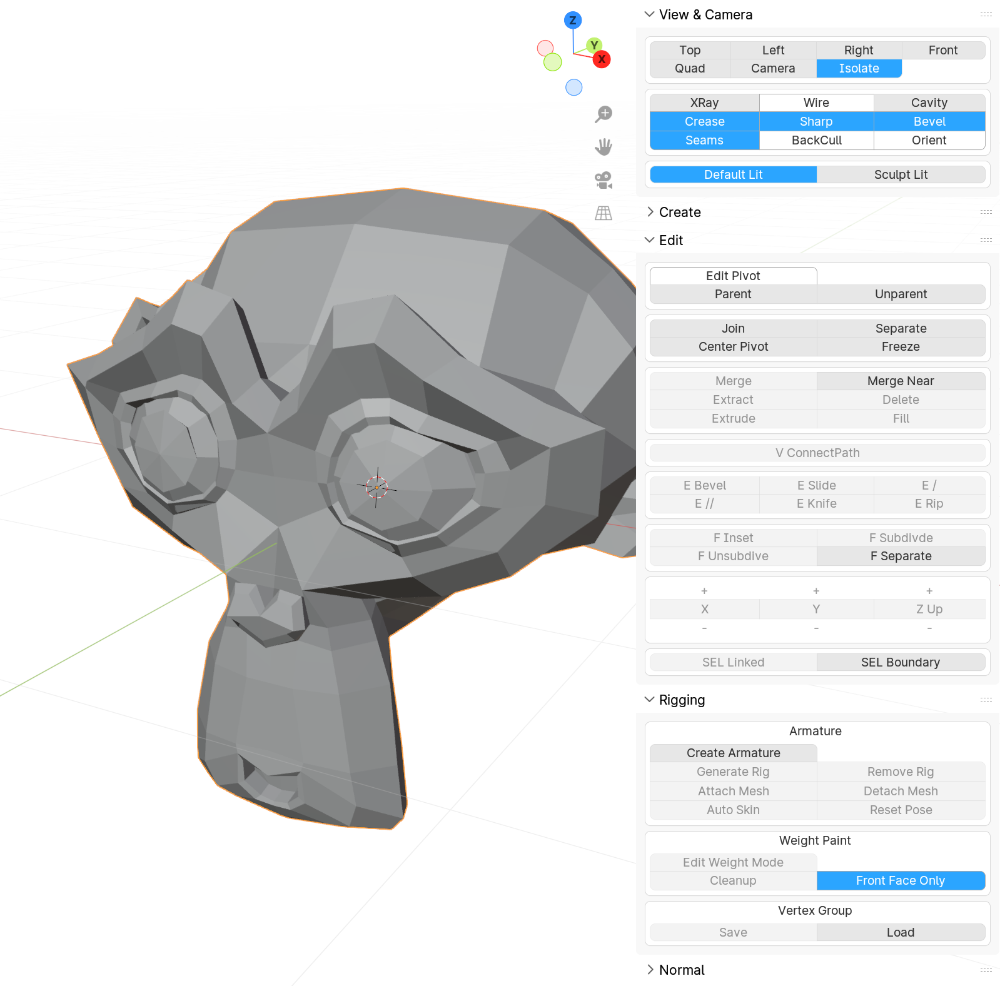

# OB Tools



블렌더를 깊게 이해하고 편리하게 사용하기 위해 만든 Add-on입니다.

주요 기능

* 재귀적 자동 오퍼레이터 클래스 등록.
* 원버튼 파이썬 스크립트 및 Add-on 리로드.
* JSON 형태 웨이트 저장 및 로드.
* 웨이트 페인트를 편하게 하기 위한 모드 스위칭.
* 프로토타입 모델링 편의를 위한 재질 Copy&Paste

...등이 있습니다.

## 설치

### 윈도우 (개발자)

1) 적절한 경로로 클론.

```sh
git clone https://github.com/oiehot/ob_tools.git d:/ob_tools
```

2) 클론한 디렉토리를 블렌더 addons 폴더로 Junction 링크 (관리자 권한 필요)

```sh
mklink /j "C:/Program Files/Blender Foundation/Blender 4.0/4.0/scripts/addons/ob_tools" "D:/ob_tools"
```

3) 블렌더 시작 후 Preferences > Add-ons 에서 ob_tools로 검색한 뒤 켜기.